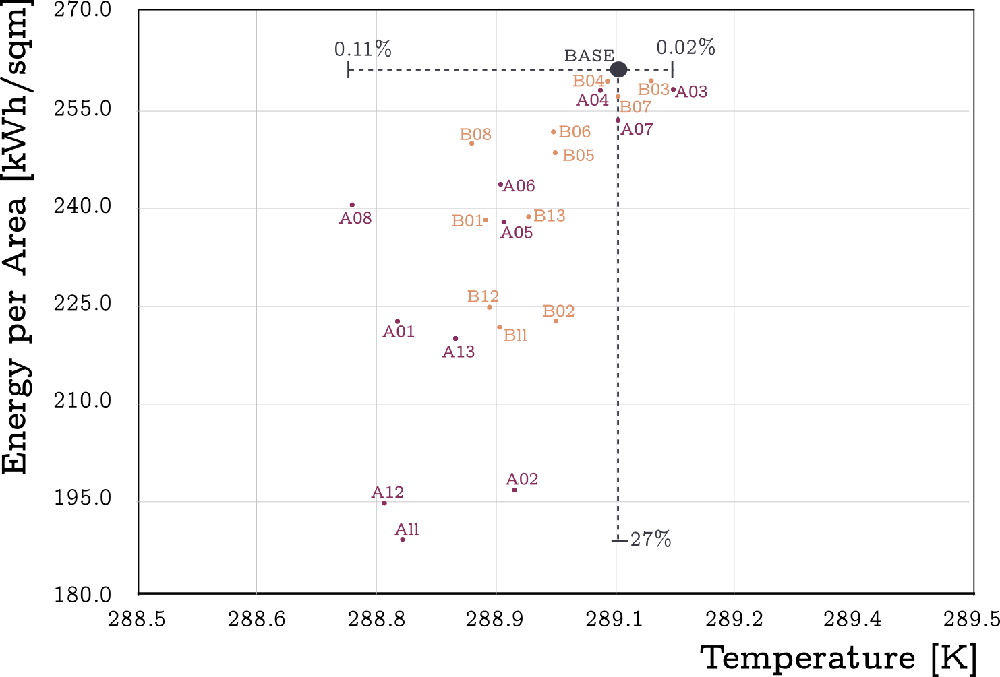

<p align="center">
  
</p>
<!-- <br><br> -->
<p align="center"><br>
  <a href="https://www.r-project.org" target="_blank">
    
  </a>
  &emsp;
  <a href="https://energyplus.net" target="_blank">
    
  </a>
</p>

---

This platform integrates the *virtues* of existing **housing stock energy models**, in particular their representation of the composition and attribution of the stock&mdash;albeit in reduced form&mdash;with mechanisms to quantify *uncertainties* and to explore the potential impacts of *policies and strategies* to <span style="font-weight:bold;color:#3465a4;font-size:16px;line-height:1 ">decarbonise</span> the UK housing stock.

---

## Features

+ Development of an open-access modular platform

+ Generation of explicit volumetric archetypes

<p align="center"><br>
  
<br></p>

+ Evaluation using dynamic simulation based on data survey

    (i.e. of envelope properties and household variables)

+ Standardisation of data and modelling algorithms

+ Analysis of drivers of decision-making regarding energy use intensity

  <p align=center> &diams;</p>

+ `R` is used to manage the processing of data characterising the housing stock and the corresponding constructing of typological models.

+ `EnergyPlus` is used to perform the dynamic simulation

+ The processes are decoupled from the platform, so they can be executed using a `High Performance Computing` facility


<br/>


> In [brief](#brief), the homogeneity of the UK housing stock is represented by **adaptable cuboids**. In this way, we can represent the key residential types of the stock such as *detached houses, semi-detached, end of terrace, mid terraced, apartments and bungalows*. These forms, complemented with their semantic attributes that extend to describe occupancy and systems characteristics (e.g. heating, lighting and appliance) comprehensively and robustly describe our stock typologies, but now based on an explicit *volumetric representation*.

<p align="center"><br>
  
<br></p>


### Overview of the workflow and advantages

<p align="center"><br>
  
<br></p>

The process described in the Figure is applied to study *3* main areas:

#### a) Sensitivity Analysis
<p align="center"><br>
  
<br></p>

#### b) Stock Modelling
<p align="center"><br>
  
<br></p>

#### c) Diffusion of Improvements
<p align="center"><br>
  
<br></p>


## Outcomes

We have a platform that enables the interplay between *energy, comfort and fuel poverty* to be systematically explored as well as the **effectiveness of strategies** to bring about changes in investment and day-to-day operational behaviours and the technologies destined to support these changes. This is essential in the formulation of robust decarbonisation policies and strategies.

The **housing stock decarbonisation in the UK** is a process that requires _constant update and validation_. `EnHub` provides the ability to support such a long-term strategy for its successful accomplishment.


<br><br>

---

<br><br>

## System requirements
<p align="left">
  <a href="https://cran.r-project.org/" target="_blank"></a>
  <a href="https://energyplus.net/downloads" target="_blank"></a>
  <a href="https://www.openstudio.net/downloads" target="_blank"></a>
  <a href="#"></a>
</p>

#### OS Support
The software has been developed and tested on
* ```Ubuntu 14.04``` or later
* ```Mac OS X 10.9.0``` or later
* ```Scientific Linux SL7```
* ```Windows 10``` <sup id="f1">[+](#footwin)</sup>

<b id="footwin"><sup>+</sup></b> The support for parallelisation has not been tested in Windows. Hence, it is possible that some of the functions will not work on this OS. [↩](#f1)


<br />
<br />

---

## References and further reading

  :black_small_square: G. Sousa, B.M. Jones, P.A. Mirzaei, D. Robinson, A review and critique of UK housing stock energy models, modelling approaches and data sources, Energy and Buildings (2017) 66–80. doi:http://dx.doi.org/10.1016/j.enbuild.2017.06.043.

  :black_small_square: G. Sousa, B.M. Jones, P.A. Mirzaei, D. Robinson, An open-source simulation platform to support the formulation of housing stock decarbonisation strategies, Energy and Buildings (2018). doi:http://dx.doi.org/10.1016/j.enbuild.2017.06.043.


<br />
<br />


## Contact us for questions and feedback
:email: Get in touch by email at <a href="mailto:g.sousa@sheffield.ac.uk"> University of Sheffield</a>
<br>
:notebook: Follow the project in <a href="https://www.researchgate.net/project/Housing-stock-Energy-Hub-EnHub"> ResearchGate</a>
<br>
:wrench: Follow the [wiki](https://github.com/EnHub-UK/Platform/wiki)


## License

<a rel="license" href="http://creativecommons.org/licenses/by-nc-sa/4.0/"></a><br /><span xmlns:dct="http://purl.org/dc/terms/" property="dct:title">EnHub-UK</span> is licensed under a <a rel="license" href="http://creativecommons.org/licenses/by-nc-sa/4.0/">Creative Commons Attribution-NonCommercial-ShareAlike 4.0 International License</a>.
You can also read the full terms in ```LICENSE.md```
